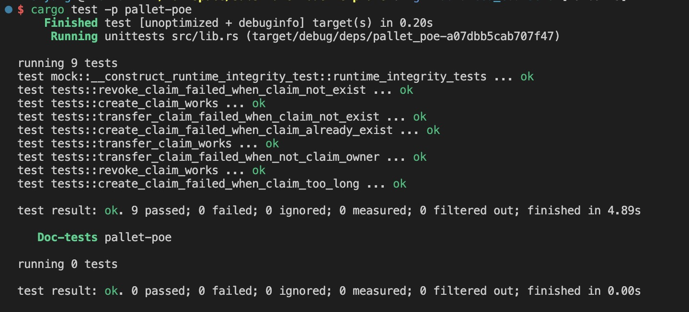

```shell
running 9 tests
test mock::__construct_runtime_integrity_test::runtime_integrity_tests ... ok
test tests::transfer_claim_failed_when_claim_not_exist ... ok
test tests::revoke_claim_works ... ok
test tests::create_claim_failed_when_claim_already_exist ... ok
test tests::create_claim_works ... ok
test tests::revoke_claim_failed_when_claim_not_exist ... ok
test tests::transfer_claim_works ... ok
test tests::transfer_claim_failed_when_not_claim_owner ... ok
test tests::create_claim_failed_when_claim_too_long ... ok

test result: ok. 9 passed; 0 failed; 0 ignored; 0 measured; 0 filtered out; finished in 3.69s


running 0 tests

test result: ok. 0 passed; 0 failed; 0 ignored; 0 measured; 0 filtered out; finished in 0.00s
```

